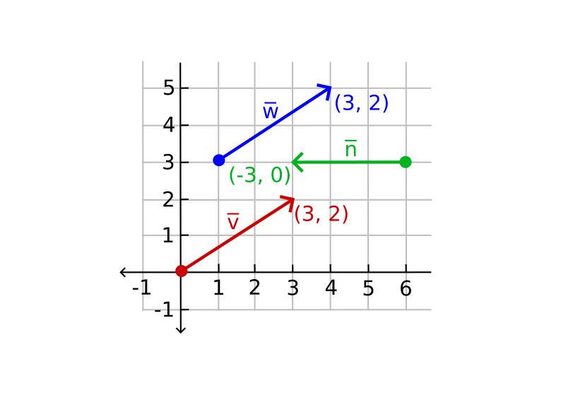
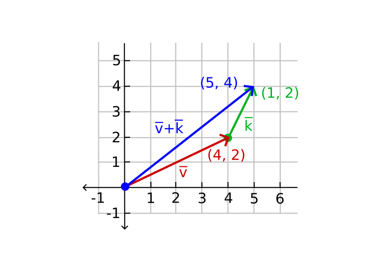
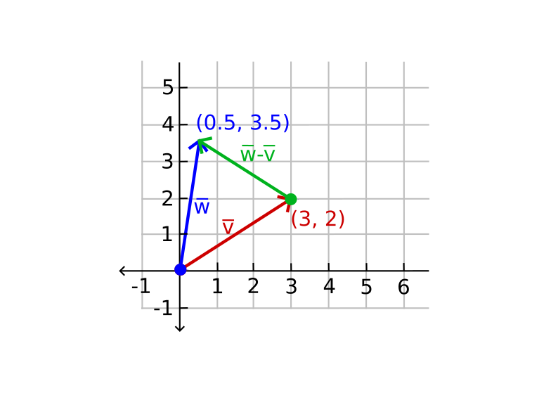
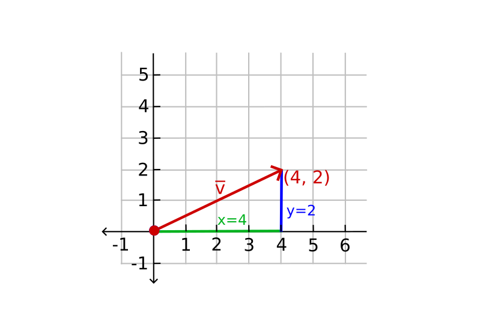
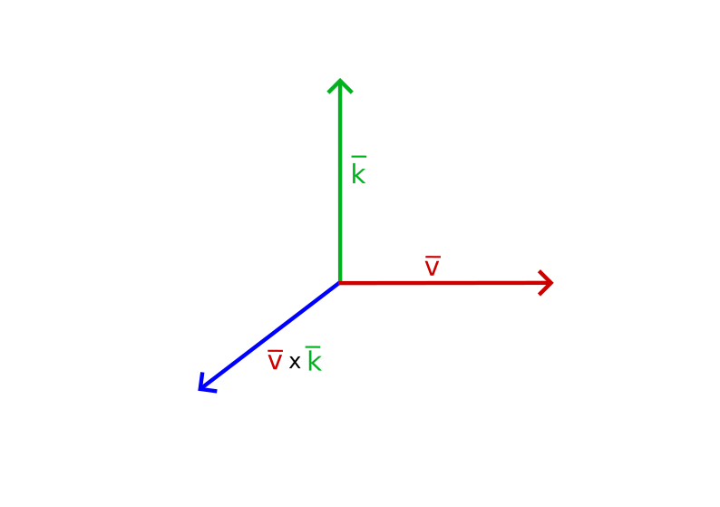
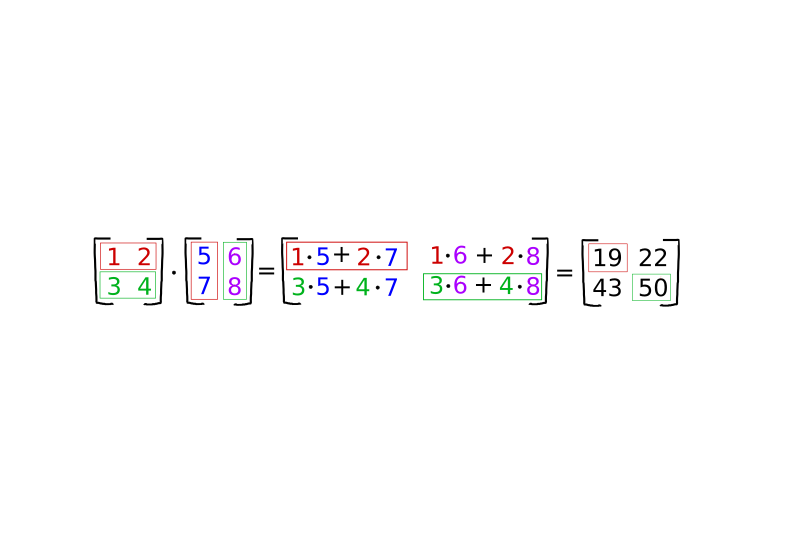
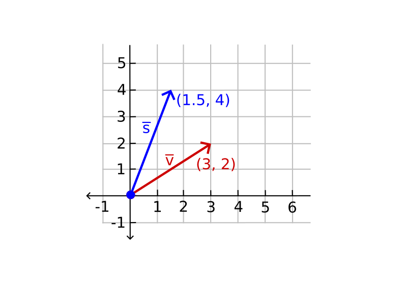
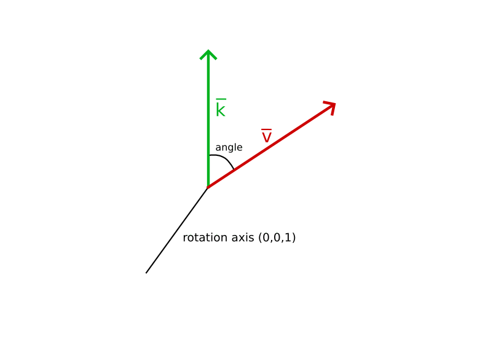

# Transformations with OpenGL - Basic Theory
## 1. Vectors
**Vectors** are a quantity that has *direction* and *magnitude* which is represented by a directed line segment.

A vector with (x, y) as an arrow are represented in *2D space*. However, a vector with (x, y, z) as an arrow are represented in *3D space*. In the graph, we can see that the vectors v and w are equal even though their origin is different.

Mathematicians prefer to describe vectors as character symbols with a little bar over their head like v. 

Vectors in formulas look like this: 

$$v=\begin{pmatrix}x\cr y\cr z\cr\end{pmatrix}$$

### 1.1 Scalar vector operations
A **scalar** is a single digit. Adding, subtracting, multiplying or dividing a vector with a scalar mean we add, subtract, multiply, or divide each element of the vector via a scalar.
$$\begin{pmatrix}1\cr 2\cr 3\cr\end{pmatrix}+x -> \begin{pmatrix}1\cr 2\cr 3\cr\end{pmatrix}+\begin{pmatrix}x\cr x\cr x\cr\end{pmatrix}=\begin{pmatrix}1+x\cr 2+x\cr 3+x\cr\end{pmatrix}$$

Where + can be +, &#8213;, or / where &#0183; is the multiplication operator.

### 1.2 Vector negation
**Negating** a vector means it proceeds in a vector in the reversed direction. To negate a vector, we add a minus sign to each components.

### 1.3 Addition and subtraction
The addition of two vectors is called a **component-wise** addition. This means each component of one vector is added to the same component of the other vector. 

$$\overline{v} = \begin{pmatrix}1\cr 2\cr 3\cr\end{pmatrix}, \overline{k} = \begin{pmatrix}4\cr 5\cr 6\cr\end{pmatrix}-> \overline{v}+\overline{k}=\begin{pmatrix}1+4\cr 2+5\cr 3+6\cr\end{pmatrix}=\begin{pmatrix}5\cr 7\cr 9\cr\end{pmatrix}$$

It looks like this on vectors v=(4, 2) and k=(1, 2), where the second vector's origin point is added on top of the first vector's end point to find the end point of the resulting vector. This is called the **head-to-tail** method.

Vector subtraction is the same as vector addition with a negated second vector:

$$\overline{v} = \begin{pmatrix}1\cr 2\cr 3\cr\end{pmatrix}, \overline{k} = \begin{pmatrix}4\cr 5\cr 6\cr\end{pmatrix}-> \overline{v}+-\overline{k}=\begin{pmatrix}1+(-4)\cr 2+(-5)\cr 3+(-6)\cr\end{pmatrix}=\begin{pmatrix}-3\cr -3\cr -3\cr\end{pmatrix}$$

Subtracting two vectors results in a vector that is the difference of the positions both vectors are pointing at. This is important in cases where we need to find the vector that is the difference between two points. 

### 1.4 Length
We use the **Pythagoras theorem** to retrieve the *length* and *magnitude* of a vector. A vector forms a triangles where you see its x and y component as two sides of a triangle.

We know the length of two sides (x, y). We want to find the length of the titled side v. We can calculate it using the Pythagoras theorem as:

$$||\overline{v}|| = \sqrt{x^2 + y^2}$$

Where &#8214;v&#8214; represents as the *length of the vector* v. For 3D, add z2 to the equation.

In this case the length of vector (4, 2) is equal to:

$$||\overline{v}|| = \sqrt{4^2 + 2^2} = \sqrt{16 + 4} = \sqrt{20} = 4.47$$

The answer is `4.47`.

A **unit vector** is a special type of vector that contains one extra property and it has a condition where its length is exactly 1. We calculate the unit vector n from any vector by dividing each of the vector's components by its length:

$$ \hat{n} = { \overline{v} \over ||\overline{v}||} $$

This is called **normalizing** a vector. **Normalizing** a vector means to take a vector of any length, keep it pointing the same direction, change its length to 1, turning it into a **unit vector**. Unit vectors are shown with a little roof over their head. They are easier to work with, this is especially handy when we only care about their directions (the direction stays the same if the vector's length changes).

### 1.5 Vector-vector multiplication
Normal multiplication is not really used on vectors since it has no visual meaning. There are two specific cases that we could choose for multiplying. One is the **dot product** denoted as v &#0183; k
and the other is the **cross product** denoted as v x k.

#### 1.5.1 Dot product
The dot product of two vectors is equal to the scalar product of their lengths times the cosine of the angle between them. The formula is the following:

$$\overline{v} \cdot \overline{k} = ||\overline{v}|| \cdot ||\overline{k}|| \cdot \cos(\theta)$$

Theta (&#0952) is the angle between two vectors. If v  and k  are unit vectors, their length would be equal to 1. This would mean the formula is:
$$\hat{v} \cdot \hat{k} = 1 \cdot 1 \cdot \cos(\theta) = \cos(\theta)$$

This formula *only* defines the angle between two vectors. Cosine function becomes 0 when the angle is 90 degrees or 1 when the angle is 0. This provides a easy method to test if two vectors are orthogonal or parallel to each other using the dot product. **Orthogonal** means the vectors are at a right-angle of each other. 

The **dot product** is a component-wise multiplication where we add the results together. Here is an example with two unit vectors:
$$\begin{pmatrix}0.6\cr -0.8\cr 0\cr\end{pmatrix} \cdot \begin{pmatrix}0\cr 1\cr 0\cr\end{pmatrix} = (0.6 * 0) + (-0.8*1) + (0*0) = -0.8$$

To get the degree between these two unit vectors, we use the inverse of the cosine function cos-1. The result is 143.1 degrees. For example, it would be cos-1(-0.8) = 143.1 degrees. The dot product is useful when performing lighting calculations. 

#### 1.5.2 Cross product
The cross product is only defined in *3D space*. The cross product takes two non-parallel vectors as the input and yields a third vector that is *orthogonal* to both the input vectors.  When two of the input vectors are orthogonal to each other, a cross product would proceed with 3 orthogonal vectors. 

For example, here is the cross product of two orthogonal vectors A and B:

$$\begin{pmatrix}Ax\cr Ay\cr Az\cr\end{pmatrix} \times \begin{pmatrix}Bx\cr By\cr Bz\cr\end{pmatrix} = \begin{pmatrix}Ay \cdot Bz - Az \cdot By \cr Az \cdot Bx - Ax \cdot Bz \cr Ax \cdot By - Ay \cdot Bx \cr\end{pmatrix} $$

## 2. Matrices
A **matrix** is a rectangular array of numbers, symbols, and/or mathematical expressions. Each individual item in a matrix is called an **element** of the matrix. 
$$\begin{bmatrix}1&2&3\cr 4&5&6 \end{bmatrix}$$

Matrices are indexed by (i, j) where i is the row and j is the column, that is why the above matrix is called a 2x3 matrix (4 columns and 2 rows, also known as the **dimensions** of the matrix). This is different when indexing 2D graphs as (x, y). To get the value 4, we would index it as (2, 1) (second row, first column).  

Matrices have a nice set of mathematical properties and just like vectors we can define several operations on matrices which are addition, subtraction, and multiplication. 

### 2.1 Addition and subtraction
Matrix addition and subtraction between two matrices is done a per-element basis. The same general rules apply with normal numbers, but they are done on the elements of both matrices with the same index. This means that addition and subtraction is only allowed for matrices of the same dimensions. A 3x2 matrix and a 2x3 matrix cannot be added or subtracted together. 

An example of how matrix addition works on two 2x2 matrices:

$$\begin{bmatrix}1&2\cr 3&4 \end{bmatrix} + \begin{bmatrix}5&6\cr 7&8\end{bmatrix} = \begin{bmatrix}1+5&2+6\cr 3+7&4+8\end{bmatrix} = \begin{bmatrix}6&8\cr 10&12 \end{bmatrix}$$

Another example for applying the same idea for matrix subtraction

$$\begin{bmatrix}4&2\cr 1&6 \end{bmatrix} - \begin{bmatrix}2&4\cr 0&1\end{bmatrix} = \begin{bmatrix}4-2&2-4\cr 1-0&6-1\end{bmatrix} = \begin{bmatrix}2&-2\cr 1&5 \end{bmatrix}$$

### 2.2 Matrix-scalar products
A matrix-scalar product multiples each element of the matrix by a scalar. 

An example of matrix scalar multiplication.

$$ 2 \cdot \begin{bmatrix}1&2\cr 3&4 \end{bmatrix} = \begin{bmatrix}2\cdot1&2\cdot2\cr 2\cdot3&2\cdot4\end{bmatrix} = \begin{bmatrix}2&4\cr 6&8 \end{bmatrix}$$

A scalar scales all elements of the matrix by its value. In the example above, all elements were scaled by 2.

### 2.3 Matrix-matrix multiplication
Matrix multiplication follows a set of predefined rules when multiplying. There are a few restriction:
1. You can only multiply two matrices if the *columns* on the *left hand side matrix* is equal to the number of *rows* on the *right hand side matrix*. 
2. Matrix multiplication is not **commutative** that is A &#0183; B &#8800 B &#0183; A. 

Example of a matrix multiplication of 2 2x2 matrices:

$$ \begin{bmatrix}1&2\cr 3&4 \end{bmatrix} \cdot \begin{bmatrix}5&6\cr 7&8 \end{bmatrix} = \begin{bmatrix}1\cdot5+2\cdot7&1\cdot6+2\cdot8\cr 3\cdot5+4\cdot7&3\cdot6+4\cdot8\end{bmatrix} = \begin{bmatrix}19&22\cr 43&50 \end{bmatrix}$$

Here is a detailed version of how matrix multiplication is done:

To perform matrix multiplication, you take the first matrix's first row and multiply them to the second matrix's first column. You add the products together for each row and column operation. You perform the same operation for the first matrix's first row and the second matrix's second column. You repeat the same process for the first matrix's second row.

**Important**: The size of the left matrix's columns and the right matrix's rows must be equal for this operation to work.

Example of matrix multiplication of 2 3x3 matrices

$$ \begin{bmatrix}4&2&0\cr 0&8&1\cr 0&1&0\end{bmatrix} \cdot \begin{bmatrix}4&2&1\cr 2&0&4\cr 9&4&2\end{bmatrix} = \begin{bmatrix}4\cdot4+2\cdot2+0\cdot9&4\cdot2+2\cdot0+0\cdot4&4\cdot1+2\cdot4+0\cdot2\cr 0\cdot4+8\cdot2+1\cdot9&0\cdot2+8\cdot0+1\cdot4&0\cdot1+8\cdot4+1\cdot2\cr  0\cdot4+1\cdot2+0\cdot9&0\cdot2+1\cdot0+0\cdot4 & 0 \cdot1 + 1\cdot4+0\cdot2 \end{bmatrix} = \begin{bmatrix}20&8&12\cr 25&4&34\cr 2&0&4\end{bmatrix}$$

Matrix-matrix multiplication is a quit *tedious* process and it is prone to errors. This gets very troublesome when working with larger matrices. This is the reason we let computers do the work for us. 

## 3. Matrix-Vector multiplication
A vector is a Nx1 matrix where N is the vector's number of components; this is also known as an **N-dimensional** vector. Vectors are similar to matrices, an array of numbers, but with only 1 column. We have a MxN matrix which we multiply with a Nx1 vector. Since the columns of the matrix are equal to the number of rows of the vector, matrix multiplication is allowed. 

**Important**: Many 2D/3D transformation can take place inside a matrix, and multiplying that matrix with a vector *transforms* the the vector. 
### 3.1 Identity matrix

In OpenGL, 4x4 transformation of matrices is common for several reason and the first reason is that most vectors have a size of 4. An **identity matrix** is an NxN matrix with only 0s except on its diagonal. 

This transformation of the matrix does not change the vector:

$$\begin{bmatrix}1&0&0&0\cr 0&1&0&0\cr 0&0&1&0 \cr0&0&0&1\end{bmatrix} \cdot \begin{bmatrix}1\cr2\cr 3\cr4\end{bmatrix} = \begin{bmatrix}1\cdot1\cr 1\cdot2\cr  1\cdot3 \cr 1\cdot 4 \end{bmatrix} = \begin{bmatrix}1\cr 2\cr 3\cr 4\end{bmatrix}$$

### 3.2 Scaling
When scaling a vector, we increase the length of the arrow by a specified amount to scale by without changing its direction. Since we work with 2 or 3 dimensions, we scale by a vector of 2 or 3 scaling variables which are (x, y, z). 

Example of scaling a vector v = (3, 2) by 0.5 for the x-axis and by 2 for the y-axis as s. In other words, scale the vector by (0.5, 2) as s:
7. Insert an image of scaling vector v as vector s (Done)

Since OpenGL usually operates in 3D space, we set the z-axis scale to 1 for 2D space; Leaving the z-axis the same. Scaling each axis by a different scaling factor is called **non-uniform scale**. When the scaling factor is the same for all axes, it is called a **uniform scale**.

Example of scaling a vector by a matrix. The scaling variables are represented as (S1, S2, S3);. We can define a scaling matrix on any vector (x, y, z) as:

$$\begin{bmatrix}S1&0&0&0\cr 0&S2&0&0\cr 0&0&S3&0 \cr0&0&0&S4\end{bmatrix} \cdot \begin{bmatrix}x\cr y\cr z\cr1\end{bmatrix} = \begin{bmatrix}S1\cdot x\cr S2\cdot y\cr  S3\cdot z \cr 1 \end{bmatrix}$$

**Note**: The 4th scaling value is 1. The w component is used for other reasons.  
### 3.3 Translation
**Translation** is the process of adding another vector on top of the original vector to return a new vector with a different position; this means we are *moving* the vector based on a translation vector. 

We utilize a 4x4 matrix to perform certain operations and for translation; the important translation values are the top-3 values of the 4th column. We represent the translation vector as (Tx, Ty, Tz) and we implement the translation matrix by:

$$\begin{bmatrix}1&0&0&Tx\cr 0&1&0&Ty\cr 0&0&1&Tz \cr0&0&0&1\end{bmatrix} \cdot \begin{bmatrix}x\cr y\cr z\cr 1\end{bmatrix} = \begin{bmatrix}x\cdot Tx\cr y\cdot Ty\cr  z\cdot Tz \cr 1 \end{bmatrix}$$

This is allowed since all of the translation values are multiplied by the vector's w column (which is 1) and added to the vector's x, y, and z components. This is not allowed with a 3x3 matrix. 

> **Homogeneous coordinates**
> The **w** component of a vector is also known as a **homogeneous coordinate**. We get the 3D
> vector from a homogeneous vector when we divide the x, y, and z coordinates by its w
> coordinate. This is not noticeable since the w component is usually 1.0. Using a homogeneous
> coordinates allows use to do matrix translation on 3D vectors; without a w component, we can't
> translate vectors. It also allows use to use the w value to create 3D perspective. 
> 
> When the homogeneous coordinate is equal to 0, the vector is known as **direction vector**; this is
> the case because a vector with a w coordinate of 0 cannot be translated.

A translation matrix allows us to move objects in the 3 axis directions (x, y, z) making it a very useful transformation matrix to for your transformation toolkit.

### 3.4 Rotation
A **rotation** in 2D and 3D space is represented with an **angle**. An angle can be in degrees or radians where a whole circle is 360 degrees or 2 PI radians. 

> The majority of rotation functions require an angle in radians. Degrees can be converted to radians:
> angle in degrees = angle in radians * (180 / PI)
> angle in radians = angle in degrees * (PI / 180)
> PI roughly equals 3.14159265359

A basic 2D vector where v is rotated 72 degrees to the right or clockwise, form k:

Rotations in 3D are specified with an angle and a **rotation axis**. The angle specified will rotate the vector along the rotation axis. When rotating 2D vectors in 3D space, we set the rotation axis to the z-axis. 

With trigonometry, we can transform vectors to newly rotated vectors by an angle. This is usually done via a combination of *since* and *cosine* functions. 

A rotation matrix is defined for each unit axis in 3D space where the angle is represented with the theta symbol (&#0952;).

Rotation around the x-axis:

$$\begin{bmatrix}1&0&0&0\cr 0&\cos(\theta) &\sin(\theta)&0\cr 0&\sin(\theta)&\cos(\theta)&0 \cr0&0&0&1\end{bmatrix} \cdot \begin{bmatrix}x\cr y\cr z\cr 1\end{bmatrix} = \begin{bmatrix}x \cr \cos(\theta)\cdot y - \sin(\theta) \cdot z \cr  \sin(\theta)\cdot y + \cos(\theta) \cdot z \cr 1 \end{bmatrix}$$

Rotation around the y-axis:

$$\begin{bmatrix}\cos(\theta)&0&\sin(\theta)&0\cr 0&1 &0 &0\cr -\sin(\theta)&0&\cos(\theta)&0 \cr0&0&0&1\end{bmatrix} \cdot \begin{bmatrix}x\cr y\cr z\cr 1\end{bmatrix} = \begin{bmatrix}\cos(\theta)\cdot x + \sin(\theta) \cdot z \cr y \cr  -\sin(\theta)\cdot x + \cos(\theta) \cdot z \cr 1 \end{bmatrix}$$

Rotation around the z-axis:

$$\begin{bmatrix}\cos(\theta)&-\sin(\theta)&0&0\cr \sin(\theta)&\cos(\theta) &0 &0\cr 0&0&1&0 \cr0&0&0&1\end{bmatrix} \cdot \begin{bmatrix}x\cr y\cr z\cr 1\end{bmatrix} = \begin{bmatrix}\cos(\theta)\cdot x + \sin(\theta) \cdot y \cr \sin(\theta) \cdot x + \cos(\theta) \cdot y \cr  z \cr 1 \end{bmatrix}$$

Using the rotation matrices can transform the position vectors around one of the three unit axes. In order to rotate around a random 3D axis, we combine all 3 of them by first rotating around the x-axis, then y-axis, and lastly the z-axis. Nevertheless, this introduces an issue called **Gimbal lock**. A better solution, is to rotate around a random unit axis like (0.662, 0.2, 0.722) instead of combining the rotation matrices. A matrix exists and this is given with (Rx, Ry, Rz) as the random rotation axis:

$$\begin{bmatrix}\cos(\theta)+Rx^2(1-\cos(\theta))&RxRy(1-\cos(\theta))-Rz\sin(\theta)&RxRz(1-\cos(\theta))+Ry\sin(\theta)&0\cr RyRx(1-\cos(\theta))+Rz(\sin(\theta))&\cos(\theta)+Ry^2(1-\cos(\theta)) &RyRz(1-\cos(\theta))+Rx(\sin(\theta) &0\cr RzRx(1-\cos(\theta))-Ry\sin(\theta)&RzRy(1-\cos(\theta))+Rx\sin(\theta)&\cos(\theta)+Rz^2(1-\cos(\theta))&0 \cr0&0&0&1\end{bmatrix}$$

Note, that this matrix does not absolutely prevent gimbal lock. Representing rotations using **quaternions** is the best way to prevent Gimbal locks; these are safer and computationally light. The topic of quaternions is out of the scope of this article. 

### 3.5 Combing matrices
The true utility capability of using matrices for transformation is that we can combine multiple transformation in a single matrix by matrix-matrix multiplication. There is a vector (x, y, z). We want to scale it by 2 and translate it by (1, 2, 3). A translation and a scaling matrix are the required steps. Here is an example of the resulting transformation matrix:

$$\begin{bmatrix}1&0&0&1\cr 0&1&0&2\cr 0&0&1&3 \cr0&0&0&1\end{bmatrix} \cdot \begin{bmatrix}2&0&0&0\cr 0&2&0&0\cr 0&0&2&0 \cr0&0&0&1\end{bmatrix} = \begin{bmatrix}2&0&0&1\cr 0&2&0&2\cr 0&0&2&3 \cr0&0&0&1\end{bmatrix}$$

Note that we first have to do a translation and then scale transformation when multiplying matrices. Matrix multiplication is not *commutative*; this means the order is important. It is considered to first do scaling operations, then rotations, and lastly translation when combining matrices. If you do not follow this rule, it may negatively affect each other. For example, if you do the translation before scaling it, the translation vector would also scale!

Performing the final transformation matrix on the vector result in a different vector:

$$\begin{bmatrix}2&0&0&1\cr 0&2&0&2\cr 0&0&2&3 \cr0&0&0&1\end{bmatrix} \cdot \begin{bmatrix}x\cr y\cr z\cr 1\end{bmatrix} = \begin{bmatrix}2x+1\cr 2y+2\cr  2z+3\cr 1 \end{bmatrix}$$

Now the vector is scaled by two and translated by (1, 2, 3)

## 4. In practice
Now that we understand the theory behind transformations. We are already to apply this knowledge. The good news is that there are pre-made mathematics libraries that does this work for us. There is an easy mathematics library designed for OpenGL called GLM. 

### 4.1 GLM
GLM stands for OpenGL Mathematics and this is a header-only library. THis means we only have to include the header files and that is it. There is no need for linking and compiling. GLM can be downloaded [here](https://glm.g-truc.net/0.9.9/index.html). 

I won't be going over the code for using GLM. I recommend you begin reading at "In practice" --> "GLM" section in the [Transformations - LearnOpenGL](https://learnopengl.com/Getting-started/Transformations) article. The author's, Joey De Vries, code repository for the the OpenGL chapters is located at [JoeyDeVries/LearnOpenGL - GitHub](https://github.com/JoeyDeVries/LearnOpenGL).

## 5. Resources
- [Transformations - LearnOpenGL](https://learnopengl.com/Getting-started/Transformations)
- [About - LearnOpenGL](https://learnopengl.com/About)
- [vector definition - Merriam-Webster](https://www.merriam-webster.com/dictionary/vector)
- [Vector magnitude & normalization - Khan Academy](https://www.khanacademy.org/computing/computer-programming/programming-natural-simulations/programming-vectors/a/vector-magnitude-normalization#:~:text=To%20normalize%20a%20vector%2C%20therefore,the%20unit%20vector%20readily%20accessible.)

### 5.1 Credit to Joey De Vries
The content based on the OpenGL Tutorial - An Introduction on OpenGL with 2D Graphics article by Joey De Vries. The content is a heavily simplified version of his article in order to make it approachable for new graphics programmers. Thanks to Joey De Vries for providing this content.

I would be promoting Joey De Vries's [personal website](https://joeydevries.com/#home) if you are interested.
